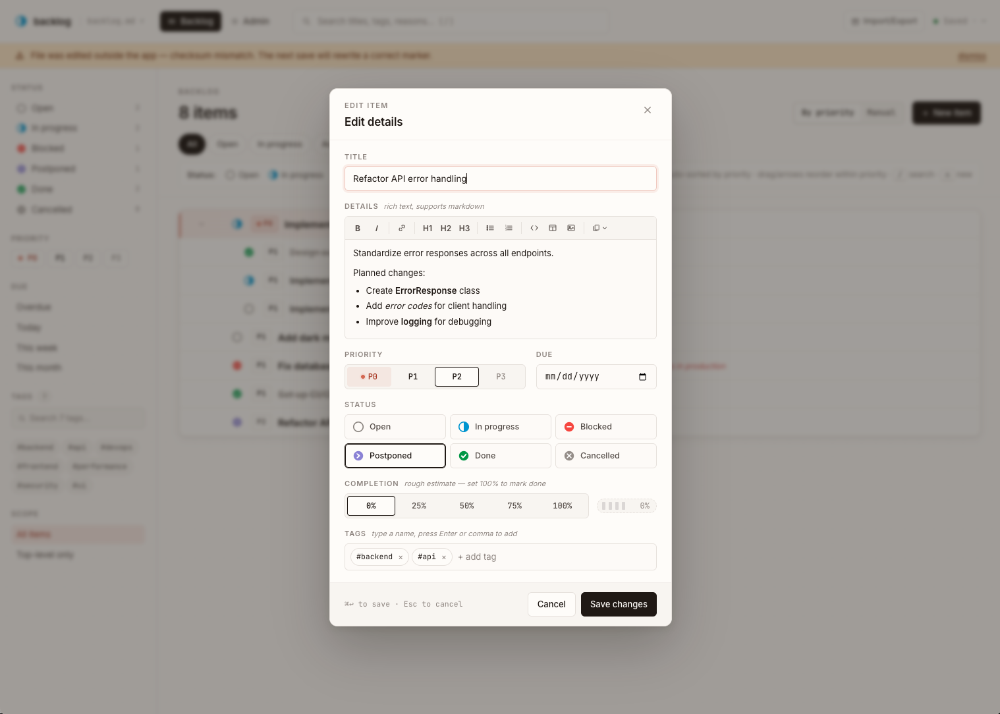

# Personal Backlog

A minimalist, single-user task manager where **a single Markdown file is your database**.

No cloud. No accounts. No vendor lock-in. Your tasks live in a plain `backlog.md` file you can read, edit, and version-control with any tool you already use.

*Main view*


*Edit existing task*


## Why Not Just Use...

| Concern | Todoist / TickTick / Notion | This App |
|---------|-----------------------------|----------|
| Where's my data? | Their servers | A single `.md` file on *your* disk |
| Online required? | Yes (cloud sync) | Never — even the server is localhost-only |
| Vendor lock-in? | You need their app to read your data | It's a `.md` file — read it in VS Code, Vim, `cat` |
| Can I `git commit` my tasks? | No | Yes — it's a text file |
| Can I sync across devices? | Built-in cloud | Any file sync — Dropbox, rsync, git, USB, anything |
| Price | $5–6/mo | Free, forever |

**If you've ever wanted your task list to be just a file — this is it.**

## Quick Start

### Option A: Python Server (all browsers)

Works with Chrome, Firefox, Safari — any browser. The server is a single Python file with zero dependencies.

```bash
cd personal-backlog
python3 server/server.py --port 8080
```

Then open **http://localhost:8080** in your browser.

The server creates `backlog.md`, `backups/`, and `stats.jsonl` in its own directory by default. To store data elsewhere:

```bash
python3 server/server.py --port 8080 --dir ~/my-backlog
```

### Option B: Standalone HTML (Chrome / Edge — file system; Firefox / Safari — IndexedDB)

No Python needed. Just open the HTML file:

```bash
open webapp/index-style-v2.html
```

Or serve it with any static file server:

```bash
cd webapp && python3 -m http.server 3000
# Then open http://localhost:3000/index-style-v2.html
```

On first launch, the browser will prompt you to **select a folder**. This is required because browsers can't access your filesystem without explicit permission. Create a folder (or pick an existing one) and the app will create `backlog.md`, `backups/`, and `stats.jsonl` inside it.

Firefox and Safari don't support the File System Access API, so the app can't read/write files on your disk directly. Instead it automatically falls back to **IndexedDB** (browser-local storage) — fully read-write, with backups and history preserved across reloads. Use the Import/Export dialog to move data between IndexedDB and a portable `.md` file at any time.

## How It Works

### The Markdown File

All your tasks live in `backlog.md`, structured as:

```markdown
# Backlog

<!-- SECTION: ENTRIES -->

- [ ] [P0] Ship landing page *(due: 2025-06-01, priority: P0, progress: 50)*
  > This is the **body** with rich text details.
  > - Milestone 1: Design
  > - Milestone 2: Build
  - [x] Design mockups *(priority: P0, progress: 100)*
  - [/] Implement frontend *(priority: P1, progress: 30)*
- [!] [P1] API integration *(priority: P1, reason: waiting for keys)*
- [>] [P2] Blog post *(priority: P2, due: 2025-07-15)*

<!-- SECTION: HISTORY -->

| Timestamp | Item ID | Action | Details |
|-----------|---------|--------|---------|
| 2025-05-10T14:32:00Z | i-m1 | status_changed | open → done |

<!-- SECTION: INTEGRITY -->

<!-- saved: 2025-05-10T14:35:12Z | checksum: sha256:abc123... | entries: 3 | history: 1 -->
```

You can edit this file in any text editor. The app detects external changes and reloads automatically.

### Archive File

Completed tasks can be moved to `archive.md` to keep the main backlog clean. The archive uses the same format with an additional `restore-path` field:

```markdown
# Archive

<!-- SECTION: ENTRIES -->

- [x] [P1] Old completed task *(archived: 2025-05-01, restore-path: i-abc/i-def)*
  > Original body preserved
  - [x] Child task also archived
```

The `restore-path` stores the original parent chain, allowing items to be restored to their original location. If the parent no longer exists, items restore to root level.

### Features

- **4-level nesting** — Area → Project → Task → Sub-task
- **6 statuses** — open, in-progress (`/`), blocked (`!`), postponed (`>`), done (`x`), cancelled (`-`)
- **Priorities** — P0 (burning) through P3, with drag-and-drop reordering within each priority
- **Progress tracking** — 0–100% per task; done auto-sets to 100%
- **Rich text body** — optional details field with WYSIWYG editor (bold, italic, links, headings, lists, code blocks, tables, images); stored as markdown; copy to clipboard as HTML (for Google Docs/Word), Markdown, or plain text
- **Due dates** — with overdue highlighting
- **Tags** — free-form labels with autocomplete
- **Quick search** — instant text search across title, body, and tags with hierarchical parent visibility
- **Integrity checks** — SHA-256 checksum on every save; warning-only on mismatch
- **Automatic backups** — timestamped on every save, rotating retention
- **Stats & metrics** — items created/completed, avg time in-progress, most active project — all from real history data
- **Import/Export** — Markdown or JSON, with checksum validation
- **Archive** — move done/cancelled items to separate `archive.md` to reduce clutter; searchable archive with restore capability; items return to original location
- **Admin page** — health monitoring, backup browser, archive manager, stats overview, manual actions
- **Dark mode** — system / light / dark, configurable in Admin → Appearance; persisted across reloads
- **Icon sets** — 4 styles (Color, Flat, Emoji, ASCII), configurable in Admin → Appearance; persisted across reloads
- **Multiple projects** — track several `backlog.md` files at once (API server mode); each stays a plain, version-controllable file anywhere on disk
- **Chrome / Edge direct file access** — reads and writes `backlog.md` on disk directly via the File System Access API; no server needed
- **Firefox / Safari support** — full read-write via IndexedDB when File System Access API is unavailable; export to `.md`/`.json` anytime to get a portable file

## Two Storage Modes

The app detects which mode to use automatically:

| | API Server | Direct File Access | IndexedDB fallback |
|---|---|---|---|
| **How to start** | Run `python3 server/server.py` | Open `webapp/index-style-v2.html` in Chrome/Edge | Open in Firefox / Safari |
| **Works in** | Any browser | Chrome, Edge only | Firefox, Safari |
| **Storage via** | HTTP REST API | File System Access API | IndexedDB (browser-local) |
| **Folder picker** | Not needed | Required on first launch | Not needed |
| **Saves to disk** | Yes — plain `.md` file | Yes — plain `.md` file | No — browser storage only |
| **LAN access** | Yes (phone, tablet) | No (local browser only) | No |
| **Admin shows paths** | Yes (full path) | Folder name only | — |

### Multiple Projects (API Server Mode)

In API server mode the server can track several task files. It keeps a small registry (`projects.json` in the data dir) of which files belong to the app. Each project is still a plain `backlog.md` anywhere on disk — readable, editable, and version-controllable with any tool, as before. `backups/` and `archive.md` live next to each project's file; `stats.jsonl` stays global in the data dir.

Register a project via **Admin → Projects** (a path to a directory or a `.md` file), or from the command line:

```bash
curl -X POST localhost:8080/api/projects -H 'Content-Type: application/json' -d '{"path": "/path/to/dir"}'
```

Directories get `backlog.md` appended automatically; a missing file is created. An optional `"name"` field sets the display name.

With one project the app looks exactly as before. With several, the main view splits into collapsible per-project sections — rename or remove a project from its section header or from Admin. Import/Export picks a target project in multi mode.

NixOS: works out of the box — the `dataDir` `backlog.md` is auto-registered as `default` on first start. No module config change needed.

Standalone HTML (direct file access and IndexedDB modes) stays single-project.

### Why the Folder Picker? (Direct Mode)

When you open the HTML file directly, the browser has no access to your filesystem. The **File System Access API** (`showDirectoryPicker()`) is the only way to read and write local files from a web page. You grant permission once; the handle is stored in IndexedDB so it persists across reloads.

**To reset the folder** (pick a different one or clear saved permissions):

1. Open DevTools → Application → IndexedDB → delete the `pb-storage-v2` database
2. Reload the page — you'll be prompted to pick a folder again

## Coherency Between Python and Standalone Versions

Both versions read and write the **exact same `backlog.md` format**. The Parser and Serializer are identical in logic. This means you can:

1. **Start with the Python server** — add tasks, create structure
2. **Shut down the server** — open the same `backlog.md` location via the standalone HTML
3. **Switch freely** — edits in one mode are visible in the other

### How to Switch Modes

**From API server to standalone:**

1. Stop the server (`Ctrl+C`)
2. Open `webapp/index-style-v2.html` in Chrome/Edge
3. When prompted, select the folder that contains your `backlog.md` (e.g. the `server/` directory or wherever `--dir` pointed)

**From standalone to API server:**

1. Note which folder your `backlog.md` lives in
2. Start the server pointing to that folder:
   ```bash
   python3 server/server.py --dir /path/to/your/folder
   ```
3. Open `http://localhost:8080`

### Important Notes

- **Don't run both modes simultaneously** against the same `backlog.md` — the last writer wins and you may lose edits.
- **External edits** (Vim, VS Code, etc.) are detected automatically via checksum polling every 5 seconds. If you have unsaved changes in the app, you'll get a conflict resolution dialog.
- The **checksum is a save indicator**, not a gate. If it mismatches (e.g. you edited the file by hand), the app still loads it — just with a yellow warning banner. The next save recalculates a correct checksum.

## Project Structure

```
personal-backlog/
├── README.md
├── doc/
│   ├── requirements/requirements.md      # Functional & non-functional requirements
│   └── architecture/
│       ├── architecture.md               # High-level architecture
│       └── tdd.md                        # Technical Design Document
├── server/
│   ├── server.py                         # Python REST API server (~450 LoC, stdlib only)
│   ├── backlog.md                        # Master data file (created on first run)
│   ├── archive.md                        # Archived items (created on first archive)
│   ├── backups/                          # Automatic timestamped backups
│   └── stats.jsonl                       # Append-only analytics log
├── web/                                  # V2 source code (React 18 + JSX) + build tooling
│   ├── index.html                        # Dev entry point (React + Babel from CDN)
│   ├── styles.css                        # All CSS
│   ├── storage.jsx                       # Parser, ApiBackend, DirectBackend, SyncPoller
│   ├── helpers.jsx                       # Utility functions, event handling
│   ├── app.jsx                           # Root App component, state, save/load lifecycle
│   ├── tree.jsx                          # Task tree rendering
│   ├── dialogs.jsx                       # Modal dialogs
│   ├── admin.jsx                         # Admin dashboard
│   ├── filter-panel.jsx                  # Filter sidebar
│   ├── tweaks-panel.jsx                  # Settings panel
│   ├── data.jsx                          # Seed data (test-only, not loaded by default)
│   ├── bundle.js                         # Build tool: multi-file JSX → single HTML
│   ├── package.json                      # @babel/core + @babel/preset-react
│   └── node_modules/
├── webapp/                               # Built output — ready to open or deploy
│   └── index-style-v2.html              # Self-contained single-file SPA (~361 KB)
```

## Development

### Running the Dev Server (in-browser Babel)

```bash
cd web
python3 -m http.server 9000
# Open http://localhost:9000 — React + Babel load from CDN, no build step needed
```

### Building the Production Bundle

```bash
cd web
npm install          # once, to install @babel/core + @babel/preset-react
node bundle.js index.html ../webapp/index-style-v2.html
```

The bundler pre-compiles all JSX, swaps React dev CDN builds for production minified builds, removes Babel entirely, and writes a single self-contained HTML file to `webapp/`.

See [`doc/architecture/tdd.md`](doc/architecture/tdd.md) for full technical details.

### Requirements

- **Runtime**: Python 3.8+ (server), any modern browser
- **Development**: Node.js 18+ (for the bundler only)
- **Bundler deps**: `cd web && npm install`

## License

Personal use. Do whatever you want with it.
